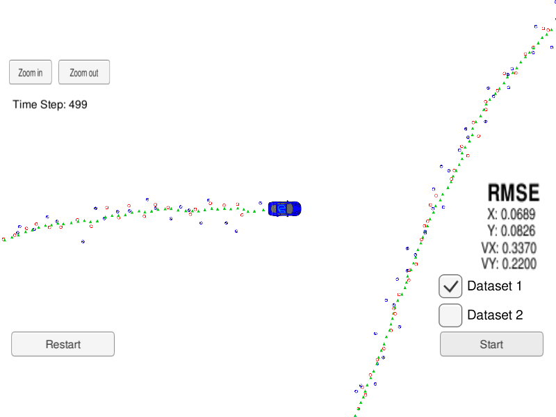
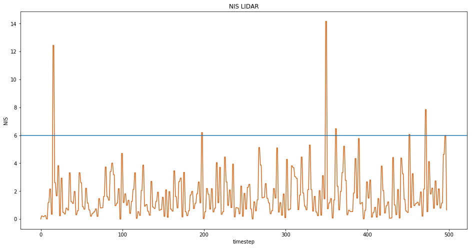
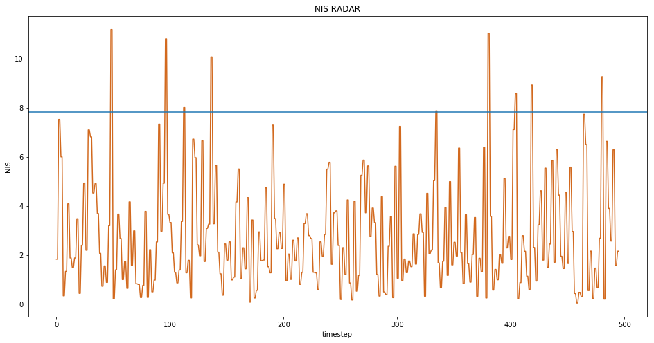

# Unscented Kalman Filter

## Overview

In this project I use a Kalman Filter to estimate the state of a moving object of interest with noisy lidar and radar measurements. The filter makes a prediction based on the sensor measurement and then update the expected position. See files in the `src` for the primary C++ files making up this project.

## Prerequisites

* cmake >= 3.5
* make >= 4.1 
* gcc/g++ >= 5.4
* uWebSocketIO

[This](https://github.com/udacity/CarND-Unscented-Kalman-Filter-Project) repository contains all instructions for the Project.

This project involves the Udacity's Term 2 Simulator which can be downloaded [here](https://github.com/udacity/self-driving-car-sim/releases).

This repository includes two files that can be used to set up and intall uWebSocketIO for either Linux or Mac systems.
Once the install for uWebSocketIO is complete, the main program can be built and ran.

## Build Instructions

1. Clone this repo.
2. Make a build directory: `mkdir build && cd build`
3. Compile: `cmake .. && make` 
4. Run it: `./UnscentedKF`

## Results

We are trying to minimize the RMSE of our predicted state (after the state update step) compared to the ground truth. Our goal is to get RMSE below `[0.09, 0.10, 0.40, 0.30]`.

Also, each timestep we check the consistency of our algorithm by using a metric called Normalized Innovation Squared (NIS) which is the difference between the predicted measurement and the actual measurement normalized in relation to the state covariance matrix. We want our `NIS lidar` and `NIS radar` values to be less than `5.991` and `7.815` respectively in 95% of all cases.

## Bonus Challenge!

In [this](https://github.com/feklistoff/CarND-Catch-Run-Away-Car-UKF) Bonus Challenge I've used an Unscented Kalman Filter to try and catch a car moving in a continuous circle at constant velocity.

The result can be seen [here](https://youtu.be/A0vb_n9Rkl8).

